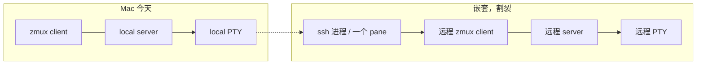
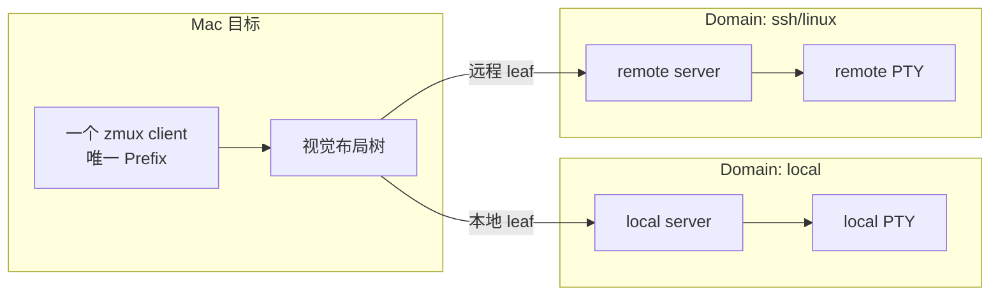
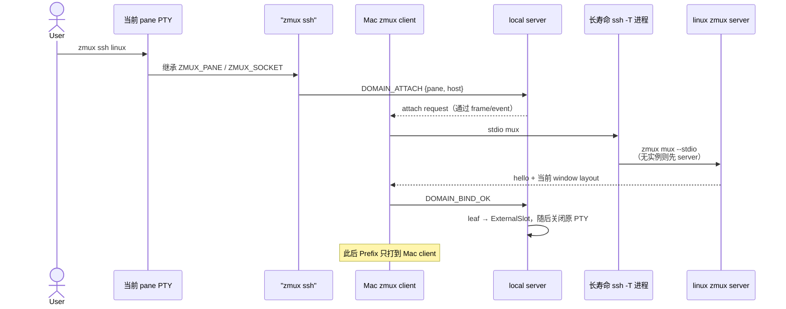
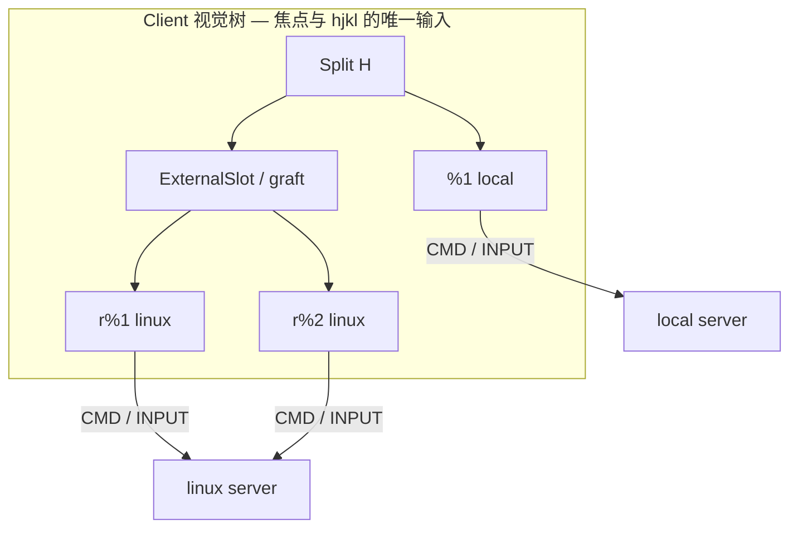
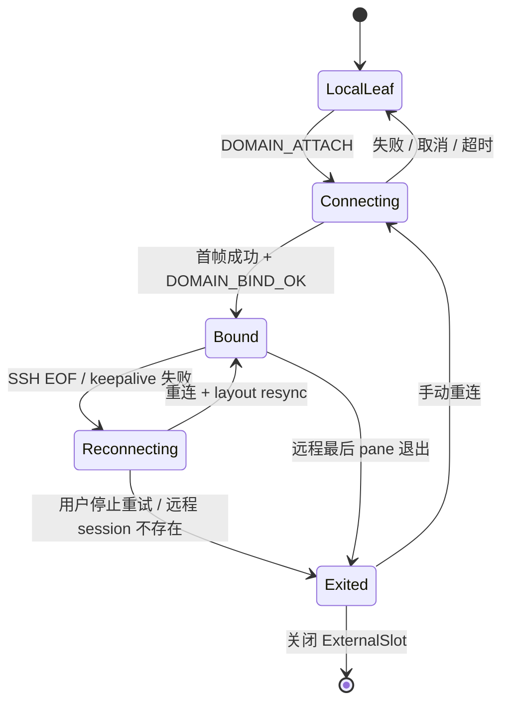
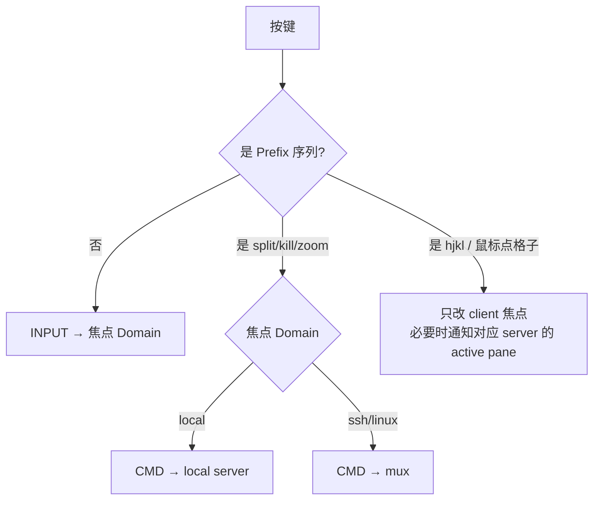
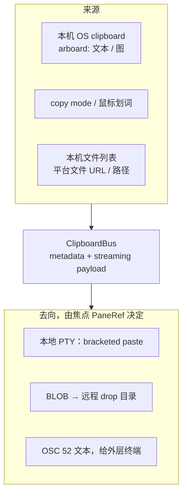
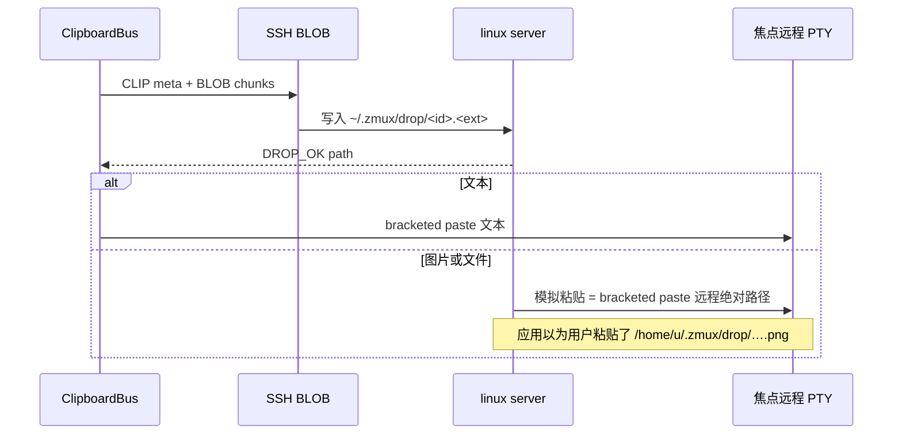

# zmux Cloud：远程 Domain 与跨端剪贴板

把「本机 zmux」和「SSH 对面那台 Linux 上的 zmux」收成**同一块画布**。Prefix 永远只由本机 client 处理，远程 pane 与本地 pane 在焦点、分割、跳转上地位相同；剪贴板由 zmux 自己搬运，不依赖 `pbcopy` / `xclip` / `wl-copy` / `scp` 用户操作。

> [!NOTE] 文档用途
> 这是实现前的逻辑规划，不是 API 冻结稿。协议字段、路径、命令名在落地时可以微调，但 **Domain 模型、ExternalSlot 所有权、命令路由、剪贴板投递** 四条主轴不应再摇摆。

## 今天为什么割裂

现在的路径是：

1. Mac 开一个终端（可能已经在 zmux 里）
2. `ssh linux`
3. 远程再 `zmux a`
4. 两套 Prefix、两套窗口、两套剪贴板

本质问题不是 SSH，而是 **Mac 上的 zmux client 只认识本机 Unix socket 背后那一个 server**。远程 zmux 是嵌套 TUI，不是一等 pane。



目标路径：



:::tip 一句话
Mac client 变成 **多 Domain 合成器**；每个 pane 属于一个 Domain；分割继承 Domain；跳转只看视觉邻居，不看机器边界。
:::

## 目标与非目标

| 要做 | 不在本阶段做 |
|---|---|
| `zmux ssh linux` 把**当前 pane** 变成远程 Domain 的入口 | 在远程再套一层 zmux client（禁止嵌套 Prefix） |
| 远程没有实例则拉起 `zmux server`，有则 attach | 要求远程开 TCP 端口或单独 VPN |
| 在远程 pane 上 split → 新 pane 落在**远程 server** | 把远程磁盘当成本机文件系统透明挂载 |
| `Prefix + h/j/k/l` 在本地 / 远程 pane 之间无缝跳转 | 多用户同时改同一远程 layout 的完美冲突解决 |
| 文本 / 图片 / 文件剪贴板由 zmux 协议搬运 | 依赖用户安装 `xclip`、`pbcopy`、`rclone`、`osc52-tool` |
| 本机复制文件/图片，在远程 pane 粘贴 → 文件落到远程并模拟粘贴 | 做完整网盘产品、多端消息同步 |
| 连接失败可回滚、断线可重连，不能误杀原 pane | 首版支持多个交互 client 同时争用同一 pane 尺寸 |

> [!WARNING] SSH 客户端本身
> 传输层**允许**调用系统 `ssh`（`~/.ssh/config`、ProxyJump、证书都已经能用）。「不依赖系统工具」约束的是**剪贴板与文件投递**，不是把 OpenSSH 重写一遍。纯 Rust `russh` 可作为后续备选，首版不挡路。

## 用户路径

本机已经有左右两个 pane。在右侧 pane 里执行：

```bash
zmux ssh linux
```

之后：

1. 右侧格子变成远程 session 的当前 window；若远程还没有 server，先静默拉起再 attach。
2. 焦点在右侧时 `Prefix + %` / `Prefix + "` → **远程** split，新格子也是远程 pane。
3. `Prefix + h` 从远程格子跳回左侧本地 zsh，无需切 tab、无需二次 Prefix。
4. 本机 Finder / 浏览器复制一张图，焦点在远程 pane 时粘贴 → 图片被送到 Linux，写入投递目录，并在该 pane 的 PTY 里模拟一次粘贴。



## 核心模型：Domain

每个 pane 带一个稳定身份：

```text
DomainId = { transport, host_alias, remote_socket, server_instance_id }
PaneRef  = { domain_id, session_id, window_id, pane_id, pane_generation }
```

`pane_id` 只在一个 server/session 生命周期内唯一，server 重启后可能复用，因此不能只用 `{domain, pane_id}`。握手生成不复用的 `server_instance_id`，pane 每次创建生成 `pane_generation`。所有 input、paste、copy、focus、split、kill、resize 和 transfer completion 都必须显式携带完整 `PaneRef` 并由 server 校验；禁止继续依赖“当前全局 active pane”作为远程命令目标。

| 操作 | 路由规则 |
|---|---|
| 键盘输入、鼠标、括号粘贴 | 送到 **焦点 pane 所属 Domain 的 server** |
| split / kill-pane / zoom / resize-pane | 同上；本地 layout 只在 Local Domain 上改树 |
| 焦点移动 `h/j/k/l` | **只走 client 视觉树**，跨 Domain |
| new-window / next-window | 默认继承**焦点 Domain**；状态栏显示该 Domain 的 window 列表 |
| new-tab（client tab） | 仍是本机「又一个 client↔server 连接」，可再 ssh-attach |
| detach `Prefix + d` | 断开本机 client；远程 server 继续活着 |
| copy mode / search / mouse reporting | 都按焦点 `PaneRef` 路由；client 坐标先减 ExternalSlot 与远程 pane origin |

resize 需要先判定被移动的 divider 属于谁，不能简单按焦点 Domain 路由：

- divider 的最低共同祖先在远程 graft 内 → 远程 server resize；
- divider 分隔 ExternalSlot 与本地兄弟节点 → 本机 server resize 顶层 slot；
- 方向上没有 divider → no-op，并给出边界提示。

zoom/kill 不跨所有权边界：远程 zoom 只占满 slot；kill 远程最后 pane 后 slot 进入 `exited`，是否移除 slot 由本机 client 决定。

> [!IMPORTANT] 权威数据在哪
> - 顶层 layout（本地 leaf + ExternalSlot）：**本机 server**
> - Local Domain 的 PTY：**本机 server**（现状）
> - Ssh Domain 的 layout / PTY：**远程 server**
> - 把 ExternalSlot 与远程 layout 合成后的**视觉树**：**本机 client**
>
> 远程 server 不知道 Mac 上还有一个本地 zsh。本机 server 不拥有远程 PTY，但必须拥有一个持久化的 `ExternalSlot`，并在 ANSI 输出中跳过该矩形；否则本地增量帧会覆盖远程画面。Client 是唯一知道两边完整布局和连接状态的地方。

### 视觉树如何长出来

`zmux ssh` 命中的本地 leaf 先两阶段替换成 **ExternalSlot**，client 再把远程 **当前 window 的整棵 layout 树** graft 到槽位矩形内。

两阶段替换是硬要求：

1. 原本地 pane 继续存活，client 建 SSH、握手并取得首帧。
2. 成功后 client 回 ACK，本机 server 才把 leaf 变成 `ExternalSlot` 并关闭原 PTY。
3. 任一步失败都保留原 pane，在其中显示错误；不能先杀 shell 再尝试连接。
4. ExternalSlot 保存 `slot_id`、host alias、remote socket/session/window selector 和连接状态，detach 后可以恢复。

```text
attach 前（本机 server 的 window）          attach 后（client 视觉树）

    Split H                                     Split H
    ├─ Leaf %1  local                           ├─ Leaf %1  local
    └─ Leaf %2  local  ← 在这里跑 zmux ssh      └─ ExternalSlot #7
                                                  └─ graft  remote window
                                                     ├─ Leaf r%1  ssh/linux
                                                     └─ Leaf r%2  ssh/linux
                                                      （若远程当时是单 pane，则只有一格）
```

之后：

- 焦点在 `r%1` 上 split → 远程 `split-window` → 远程推新 layout → client **重新 graft 这一槽**
- 焦点在 `%1` 上 split → 本地 `split-window` → 本机 server 更新顶层 layout；ExternalSlot 跟着本地 rect 变
- 本机 server 序列化 ExternalSlot 时只输出几何和连接元数据，不创建 PTY、不绘制内容 ANSI
- 远程 window 的 border/zoom/resize 都被限制在槽位内；远程 zoom 不能覆盖槽位外的本地 pane



:::warning 和「再开一个 tab 连远程」的差别
现有 client tab 已经能连**另一个本机 socket**。SSH Domain 可以先复用「多 SocketClient」骨架，但 **tab ≠ 混排 pane**：tab 切的是整块屏幕，graft 才能让左右格子分属两台机器。首个可演示切片可以是「远程先占一个 tab」，混排必须在同一切片里把视觉树做完，否则「pane 平等」不成立。
:::

### 槽位关闭与窗口语义

| 动作 | 明确定义 |
|---|---|
| 远程 leaf 上 `kill-pane` | 发到远程 server；远程还有 pane 时重新 graft |
| 杀掉远程最后一个 pane / 远程 session 退出 | ExternalSlot 进入 `exited`，显示重连/关闭提示；默认不自动新建本地 shell |
| 关闭 ExternalSlot | 只移除顶层槽位并断开该 Domain 引用；不默认 kill 远程 server |
| `new-window` / `next-window` | 焦点在槽内则操作远程 Domain，整个槽切换为目标远程 window |
| 远程 zoom | 只占满 ExternalSlot |
| 本机 detach | ExternalSlot 元数据留在本机 server；SSH 子进程退出，远程 server 保活 |

### Domain 基数与状态机

首版一个 `DomainId = (transport, host_alias, remote_socket)` 只允许一个 ExternalSlot。再次 attach 同一 Domain 时聚焦已有槽；如果用户确实需要两块独立远程画布，必须显式指定不同 remote socket。原因是当前远程 server 的 active session/window/pane 和 viewport 都是全局状态，两个槽无法独立切 window。



每个迁移带 generation。旧 SSH 连接迟到的 frame、ACK 或 `DROP_OK` 若 generation 不匹配必须丢弃，避免重连后污染新画面或重复粘贴。

## 传输：一条 SSH，复用协议

### 连接

1. 读 `~/.config/zmux/ssh.toml`（没有则把参数当 `ssh` host 别名）。
2. 用一个短连接执行 `zmux cloud-probe --json --socket default`，检查**正在运行的 daemon** 与远端二进制能力。
3. 探测通过后启动长寿命 `ssh -T linux -- <remote-command>`。尊重用户 `~/.ssh/config`；是否使用 ControlMaster 由 OpenSSH 配置或 zmux 可选参数决定，不把它作为协议正确性的前提。
4. 远端执行：

```bash
# 已有 server 则只 attach mux；没有则 daemon 再 mux
zmux mux --stdio --start-if-missing --socket default
```

`mux --stdio` 与现有 Unix socket 服务端共用 **同一套 session/PTY**，只是把 `FRAME` / `CMD` 换到 stdio 上。这样：

- 不需要远程监听 TCP
- 远程本机 `zmux a` 与 Mac `zmux ssh` 看到的是**同一组 pane**
- 同一个长连接复用 frame、command、input 与 blob，不为每次粘贴重新 SSH 握手

SSH stdout 必须只承载协议，stderr 单独捕获并显示为连接诊断。远程 shell banner、MOTD 或调试输出若污染 stdout，握手应以固定 magic + 长度帧拒绝连接并给出明确错误，不能尝试把杂音当 frame。

host alias 和本机 SSH 选项必须作为独立 argv 传给 `ssh`。OpenSSH 会把远程命令交给远端 shell，因此 remote binary、socket、session 等参数必须用一个经过测试的 POSIX shell-quote 函数序列化，并拒绝 NUL/换行；绝不能用 `format!` 裸拼。复杂启动命令使用配置中的参数数组，不接受任意 shell 片段。

`--start-if-missing` 在远端必须用 socket lock/原子 bind 解决两个 client 同时启动的竞争，并等到 server readiness 后才进入 mux；不能靠固定 sleep。退出本机 client 时只终止自己创建的 `ssh -T` 子进程，不关闭用户已有 ControlMaster，也不 kill 远程 zmux server。

备选（实现复杂度更低、能力更弱）：`ssh -L` 转发远程 Unix socket。作为开发期垫脚石可以，但 stdin mux 才是正式形态——剪贴板大文件不应和交互抢同一条无多路复用的 socket 帧队列而不加流控。

### 版本与能力兼容

应用版本、wire protocol 和功能 capability 必须分开判断，不能只比较 `zmux 0.x.y`：

```json
{
  "binary_version": "0.9.0",
  "server_running": true,
  "server_version": "0.8.3",
  "server_instance_id": "01K...",
  "protocol": { "major": 2, "min_minor": 0, "max_minor": 3 },
  "capabilities": [
    "domain-frame-v1",
    "targeted-pane-v1",
    "client-lease-v1",
    "blob-v1",
    "clipboard-image-v1"
  ],
  "limits": {
    "max_frame": 8388608,
    "max_blob_chunk": 262144
  }
}
```

`cloud-probe` 必须查询目标 socket 上**实际运行的 server**；只看磁盘上的新二进制不够，因为旧 daemon 可能仍持有现有 session。

兼容规则：

1. protocol major 不同 → 硬拒绝 attach。
2. major 相同 → 选择双方 minor 区间交集中的最高版本；无交集则拒绝。
3. 基础远程 pane 必需 capability：`domain-frame-v1`、`targeted-pane-v1`、`client-lease-v1`。缺任何一个都不能 attach。
4. `blob-v1`、`clipboard-image-v1` 等是可选能力：不影响基础 attach，但 UI 必须隐藏/禁用对应功能并解释远端缺什么。
5. 本地和远端协商所有数值上限的较小值。
6. `cloud-probe` 只负责提前给出可读诊断；长连接 `HELLO` 必须再次协商并作为最终权威，防止 probe 后 daemon 重启产生 TOCTOU。
7. capability 名带自身 schema 版本；行为不兼容时新增 `*-v2`，不能在同名 capability 下改变语义。

远端太旧、没有 `cloud-probe` 时归类为 `legacy_remote`，保留原本地 pane并提示：

```text
remote zmux 0.7.0 does not support cloud attach
required: protocol 2 + domain-frame-v1 + targeted-pane-v1 + client-lease-v1
running daemon: 0.7.0 on socket default
upgrade the remote binary and restart that daemon, or use: ssh linux -t zmux a
```

不能自动覆盖远程二进制，也不能为了升级自动 kill 存有 session 的旧 daemon。将来若提供 `zmux ssh --install`，必须另行设计架构探测、签名校验、原子安装和显式确认。

probe 结果可按 `{host, socket, server_instance_id}` 缓存到当前 client 生命周期；重连、daemon instance id 变化或用户执行 `--no-cache` 时失效。缓存不能绕过最终 `HELLO`。

### 协议增量

现有活跃路径并未使用 `ZMUX 1` helper：`SocketClient` 打开 frame/control 两条连接，分别发送 `ATTACH` + `FRAME?` 和行式 `CMD` / hex `INPUT`。它适合本机可信 socket，但不能直接映射到一对 stdin/stdout；二进制 BLOB 若继续 hex 也会翻倍且难以公平调度。远程 Domain 升级为 version 2 单连接二进制 envelope：

```text
magic | version | type | flags | stream_id | sequence | payload_len | payload
```

本机 Unix socket 可先保留 v1；`DomainClient` 在握手时协商 v2。未知必需能力直接报版本不兼容，不能静默降级成错误语义。

长连接的第一个 record 固定为 protocol magic/preamble，第二个必须是 `HELLO`；完成协商前不接受 `ATTACH`、frame、input 或 BLOB。若 preamble/major/capability 不兼容，双方发送可解析的 `INCOMPATIBLE`（能解析时）后关闭。远程 Cloud 通道不在同一 stream 上回退到旧行式协议；legacy fallback 只能由用户选择传统 `ssh -t ... zmux a`。

| 消息 | 方向 | 作用 |
|---|---|---|
| `HELLO` | 双向 | Domain 名、协议能力位（blob / 剪贴板 / 单 pane 订阅） |
| `DOMAIN_FRAME` | 远程 → 本机 | 原点无关的 layout + `rows_v2`/脏区；client 在 ExternalSlot 内渲染 |
| `INPUT` / `PASTE` | 本机 → 远程 | 原始输入与语义化粘贴分开；`PASTE` 由 server 按 PTY mode 加 bracketed-paste 包装 |
| `CMD` / `RESP` | 双向 | 带 request id，支持超时、错误和幂等重试 |
| `CLIP` | 本机 → 远程 | 上传元数据（kind、mime、size、name、SHA-256） |
| `CLIP_TEXT` | 远程 → 本机 | copy-mode 文本 yank；首版不承诺远程文件下载 |
| `BLOB` / `WINDOW_UPDATE` / `CANCEL` | 双向 | 分片二进制、接收窗口和取消 |
| `DROP_OK` | 远程 → 本机 | 投递完成：远程绝对路径、字节数 |

> [!TIP] 为什么不用现有绝对坐标 ANSI
> 今天 server ANSI 以整屏绝对坐标绘制。远程 window 要嵌进任意 ExternalSlot，正式协议应传原点无关的 `DOMAIN_FRAME`，由 client 平移并裁剪到槽位。首个原型可让远端发 `rows_v2` 全帧；稳定后再做按 pane/row 的 dirty frame，不能直接重放远端绝对 ANSI。

`DOMAIN_FRAME` 至少包含 `server_instance_id`、frame sequence、base sequence、full/delta 标志、layout revision、pane-relative damage rect、结构化 cells/runs、cursor、mouse mode、title 和 pane generation。client 发现 sequence 缺口、base 不匹配或 layout revision 跳变时请求 full snapshot；所有 clear/damage 都裁剪在 ExternalSlot 内，协议不允许整屏 CUP/ED/EL。

远程 server 的 client viewport = ExternalSlot 尺寸，远程内部按自己的 layout 给各 PTY resize。当前 server 只有一个全局 `size_arc`、active pane 和 latest frame，所以首版明确限制：**一个远程 server 同时只有一个交互尺寸/输入 owner**。第二个 attach 必须被拒绝或经 UI 明确抢占 lease；“只读 client”也要等 per-subscriber frame state 落地后才支持。不能用“后写尺寸”制造抖动。

v2 writer 使用三类队列：交互输入和 ACK 最高优先、frame 次之、BLOB 最低；每轮给 BLOB 有限配额。只有逻辑队列而没有 `WINDOW_UPDATE` 仍会被 SSH 单流 head-of-line blocking，因此接收端窗口、发送端上限和取消都必须在切片 0 定义。

首版协议在读取或分配内存**之前**执行硬上限（默认值可配置但不能无限）：

| 项目 | 默认硬上限 |
|---|---:|
| envelope payload / frame metadata | 8 MiB / 1 MiB |
| BLOB chunk | 256 KiB |
| MIME / display name | 255 bytes / 1 KiB |
| 解码图片 | 单边 8192 px，最多 16M pixels |
| 单批文件数 | 128 |
| 单文件 / 单批总量 | 64 MiB / 256 MiB |
| 同时传输数 | 2 |
| 每个 Domain 待发送内存 | 8 MiB |
| drop 目录总量 | 1 GiB |

超过上限返回结构化错误，不截断、不预分配声明长度。文件 payload 必须由异步/工作线程流式读写，不能放进 `Vec<u8>`；磁盘慢不能阻塞协议 reader 或交互 writer。性能门槛是：BLOB 传输时 zmux 额外引入的输入排队 p95 不超过 20 ms（网络 RTT 另计），frame 至少每 100 ms 获得发送机会。

## 命令与焦点

Prefix 只在 Mac client。client 根据 `focused: PaneRef` 决定把 `CMD` 打到哪条连接。

焦点有两个层次：`focused_slot` 属于本机顶层 layout，`focused_pane` 属于该 slot 的 Domain。跨槽 `h/j/k/l` 由合成后的 rect 做邻接命中；进入 ExternalSlot 时恢复该 slot 最近焦点的远程 pane。每次切换把 active pane 同步给目标 server，避免 command 仍作用于 server 旧 active pane。



状态栏建议：

- 左侧：`[local]` / `[linux]` 标明焦点 Domain
- window 条：展示**焦点 Domain** 的 window 列表（避免把两台机器的 `0:zsh` 揉成一份看不懂的条）
- 远程 pane 边框或 title 带 host 别名，避免和本地格子认混

## `zmux ssh` 怎么接到 zmux 上

不能靠「在 pane 里再跑一个 zmux TUI」。CLI 只做信使。当前 `ZMUX_SOCKET` 指向的是 server，不是 client，因此不能假设 CLI 可直接向 client 发命令：

| 环境 | 行为 |
|---|---|
| 在 zmux pane 内（有 `ZMUX_PANE`、本机 socket） | 向**本机 server** 发一次性 `DOMAIN_ATTACH` 请求；server 通过 frame event 交给当前尺寸/输入 lease 的 client；成功 ACK 后 CLI 退出、leaf 变 ExternalSlot |
| 在普通终端里 | 启动本机 zmux client，唯一槽位直接 ssh-attach（等价「先 zmux 再 zmux ssh」） |

需要补的环境变量（本机 server spawn PTY 时）：

- 已有：`ZMUX`、`ZMUX_PANE`
- 新增：`ZMUX_SOCKET`（本机控制 socket 名/路径）、`ZMUX_SLOT`（稳定 slot id）

`DOMAIN_ATTACH` 必须有 request id、超时和结果响应。没有活跃 client、认证需要交互但无 UI、版本不兼容时，CLI 收到非零退出码且原 pane 保持不变。首版不支持多个交互 client；server 的 input/size lease 唯一决定由哪个 client 执行请求。

配置草稿 `~/.config/zmux/ssh.toml`：

```toml
[hosts.linux]
ssh = "linux"                 # 交给 ssh 的目的，复用 ~/.ssh/config
socket = "default"
remote_zmux = "zmux"          # 远程 PATH 中的二进制
dir = "~"                     # 新建 session 时的 cwd
```

## 剪贴板：自己做总线，不调用系统剪贴板 CLI

现状：本机 client 用 `arboard` + OSC 52 写**文本**。这已经不依赖 `pbcopy` 进程，但：

- 不管图片 / 文件列表
- 不知道「当前焦点在远程」，无法把字节送到 Linux
- 远程无头机上的 `arboard` 常常根本没有 DISPLAY

目标是一条 **ClipboardBus**，OS 剪贴板只是本机的一个 backend。它是**按用户动作读取**的，不后台监听或自动上传敏感剪贴板。



### 数据类型

| kind | 本机如何拿到 | 粘贴到远程 pane 时 |
|---|---|---|
| `text` | arboard / copy mode | 经 mux `PASTE` 做语义化粘贴（server 按 PTY mode 决定 bracketed paste） |
| `image` | arboard 给出 RGBA；用 Rust 图片编码库转 PNG（不能把裸像素冒充原文件） | 见下方投递 |
| `files` | 平台 backend 读取文件列表：macOS pasteboard file URL、Windows `CF_HDROP`、Linux `text/uri-list` | 每个普通文件走 BLOB，远程落盘后模拟粘贴 |

不把「调用 `pbcopy`/`xclip`」当成实现。无头远程 **不要求** 有桌面剪贴板；远程侧的真实终点是 **PTY 输入 + 磁盘投递**。

`arboard` 只覆盖文本/图片，不足以跨平台读取 Finder/Explorer 文件列表；需要 `ClipboardBackend` trait 和平台实现。平台不支持某种 flavor 时返回明确的 `unsupported`，不能降级成空文本。

### 投递与「模拟粘贴」

本机复制文件/图片，焦点在远程 pane，用户执行显式 `Prefix + ]`（或 command mode `paste-cloud`）：

paste 开始时立刻冻结 `PasteTarget { PaneRef, connection_generation }`。传输完成后**不能重新读取当前焦点**：只有目标 PaneRef 仍存在且 generation 匹配才注入路径；用户切焦点不改变目标，目标 pane 已关闭/重建则保留已上传文件并报告 `uploaded_not_injected`。



「模拟云端粘贴」的约定（可配置，默认如下）：

1. **先把字节放到远程机器**（这里的「云端」= SSH 对面那台 host，不是第三方对象存储）。
2. 再对焦点 PTY 发语义化 `PASTE`，server 根据 parser 的 bracketed-paste mode 决定是否包裹 `ESC[200~` / `ESC[201~`：
   - 默认 `shell-paths`：POSIX shell-safe 的远程路径，空格分隔
   - 可选 `raw-paths`：逐行原始路径，适合编辑器/TUI
   - 不能宣称一种 quoting 对 shell、编辑器和所有 TUI 都正确
   - 纯文本：粘贴文本本身，不落盘
3. 远程无桌面环境时**不**尝试设置 Linux 系统剪贴板；首版也不把远程桌面剪贴板作为成功条件。

文本 paste 默认允许 UTF-8、Tab、LF、CR，拒绝 NUL 和其他 C0/ESC 控制字节；包含 bracketed-paste terminator 的 payload 也拒绝并提示。提供显式 `paste-raw` 才能发送任意 bytes。多行文本即使启用 bracketed paste 也可能被目标程序执行，UI 不得把 bracketed paste 宣称成安全沙箱。

> [!NOTE] 以后若要对象存储
> 同一套 `CLIP` + `BLOB` 可以把 sink 换成 S3。首版不引入账号、桶、生命周期。文件再大也走 SSH 分片 + 背压，避免和 FRAME 饿死。

### 文件安全与生命周期

远端绝不能直接信任本机传来的文件名或路径：

- server 自己生成 transfer id；basename 只作显示，剥离 `/`、`..`、NUL 和控制字符
- drop 根目录 0700、文件 0600；用随机 `.part` + create-new/no-follow 写入
- 校验声明大小、实际大小和 SHA-256 后原子 rename；失败/取消删除 `.part`
- 单文件、单批次、并发数和总磁盘占用都有配置上限；发送前显示大小，超限立即拒绝
- 默认保留 24 小时；只清理带 zmux manifest 且过期的文件，不扫用户其他文件
- symlink、device、FIFO、socket 与目录首版拒绝；以后目录必须先定义归档格式和解包防穿越
- 本地源在打开后校验 regular-file identity/size；传输中被替换、截断或增长则该项失败。多文件批次返回逐项结果，默认成功项可提交、失败项不注入；可选 `all-or-nothing`
- 断线重连用 transfer id + confirmed offset 续传，或明确返回“已取消”；不能重复注入路径
- server 周期性做 quota/TTL 清理并跳过 active/pinned transfer；提供 `drop list|keep|delete|clean`，按过期时间和最后访问顺序淘汰，并通知被淘汰项

### 粘贴键谁来收

| 场景 | 处理 |
|---|---|
| zmux copy mode 里 yank | 已有路径 → 写入 ClipboardBus（文本） |
| 终端产生 `Event::Paste(text)` | 只能可靠得到文本，按焦点 Domain 发语义化 `PASTE` |
| `Prefix + ]` / `paste-cloud` | client 主动读取 OS clipboard 的文本、图片或文件 flavor，再投递 |
| 远程应用自己读系统剪贴板 | 无头 Linux 上本来就不保证；我们保证的是 **PTY 收到粘贴** |

反向首版只支持远程 copy mode 文本 yank → 本机 OS clipboard/OSC 52。图片和文件是本地 → 远程单向能力；远程文件下载必须另立命令与权限/目标路径设计，不能因 `CLIP` 写成双向就暗示已经支持。

传输 UI 至少显示来源类型、项数/总大小、目标 host、进度、取消键、最终远程路径和 `injected` / `uploaded_not_injected` 状态；clipboard permission、unsupported flavor、quota、hash 和断线错误必须可区分并可针对失败项重试。

> [!WARNING] Cmd+V 的真实边界
> macOS 的 Cmd+V 通常由终端模拟器消费，zmux 收到的是 `Event::Paste(text)`，收不到“用户按了 Cmd+V”，图片/文件剪贴板甚至可能没有事件。因此首版**不能承诺拦截系统 Cmd+V 上传文件**；显式 `Prefix + ]` 才是可靠入口。终端若将 Finder 文件转换成文本路径，只按普通文本处理。

## 实现切片

不一次做完。每一刀都要能单独用、可回滚。

### 切片 0 — 协议与 mux 进程

- [ ] `zmux mux --stdio`：先把 `run_socket_server` 拆成独立 Reader/Writer 的 transport-agnostic handler；stdin/stdout 不是可 `try_clone` 的同一个 duplex stream，不能只“换 fd”
- [ ] `cloud-probe --json` 查询实际 daemon；v2 preamble/HELLO、minor 协商、capability、`INCOMPATIBLE`
- [ ] v2 envelope、request id、错误模型；本机 v1 保留，Cloud stream 禁止隐式回退
- [ ] 完整 `PaneRef` 定向 request；`server_instance_id` / generation；禁止远程请求依赖全局 active pane
- [ ] 优先队列、BLOB window/cancel、全部硬上限；stderr 与协议 stdout 分离
- [ ] 集成测试：本机双工流跑 mux，覆盖截断帧、未知版本、慢 BLOB 不饿死 input/frame

### 切片 1 — SSH Domain 连接

- [ ] `zmux ssh <alias>`（clap 子命令）
- [ ] SSH preflight probe、兼容诊断、client 生命周期缓存；长连接 HELLO 二次校验
- [ ] SSH 子进程生命周期与 client 绑定；client 退出不杀远程 server
- [ ] 远程无 socket 时 `zmux server` 再 mux
- [ ] 首版使用 `BatchMode=yes` + `StrictHostKeyChecking=yes`，支持 ssh-agent/密钥且复用已存在的 known_hosts；未知 host key、密码和交互 MFA 返回明确错误。后续若做交互认证，用受限 `SSH_ASKPASS` helper 经本地 IPC 接 client UI，不能占用协议 stdin/stdout
- [ ] keepalive、断线状态机与指数退避；手动重试立即触发
- [ ] **可演示**：client 新 tab 整屏就是远程 window（此时尚未混排）

### 切片 2 — 视觉树 graft（pane 平等）

- [ ] 本机 server 新增在其生命周期内持久的 `ExternalSlot`，ANSI 跳过该 rect；client 合成顶层 layout + graft
- [ ] `DOMAIN_FRAME` full/delta、sequence recovery、cursor/mouse metadata，在 slot 内平移/裁剪
- [ ] divider owner 路由、remote viewport resize 与唯一 input/size lease
- [ ] `DOMAIN_ATTACH` 两阶段替换、ACK/rollback、断线 placeholder 与重连恢复
- [ ] hjkl / 鼠标/copy/zoom/split/kill/window 命令按 `PaneRef.domain` 转发
- [ ] 回归：本地两格 + 右侧 ssh-attach + 远程再 split，hjkl 能进能出

### 切片 3 — ClipboardBus

- [ ] `ClipboardItem` 元数据与流式 payload 分开，避免大文件一次读入内存
- [ ] `ClipboardBackend`：文本/PNG；macOS file URL 首发，Windows/Linux 能力明确
- [ ] `CLIP`/`BLOB`/`DROP_OK`；安全临时文件、hash、原子 rename、quota、TTL、取消/续传
- [ ] 固定 `PasteTarget`；`PASTE` 语义与控制字节策略；parser mode 决定 bracketed wrapper；`shell-paths` / `raw-paths`
- [ ] 测试：假 backend + 假 mux，覆盖空格/引号文件名、超限、hash 错、断线、取消和重复 ACK

### 切片 4 — 体验打磨

- [ ] 状态栏 Domain 标记、远程 pane title 带 host
- [ ] 断线：graft 槽显示 `linux: reconnecting…`，重建 SSH 子进程，layout 以远程为准
- [ ] 大 BLOB 进度（状态栏右侧）；限制单次大小（可配，默认例如 64 MiB）
- [ ] 文档：`zmux ssh`、配置、与嵌套 `ssh`+`zmux a` 的迁移说明

## 验证矩阵

测试不能只覆盖 happy path：

| 层 | 必测场景 |
|---|---|
| 协议单元测试 | major 拒绝、minor 区间、缺必需/可选 capability、probe/HELLO TOCTOU、分帧/粘包、交错 record、截断、超大 length、未知 type/version |
| transport 集成 | 假双工流、真实 localhost SSH、stdout 污染、stderr 大量输出、keepalive 超时 |
| layout 属性测试 | 任意嵌套 split 下所有 rect 不重叠、不越 ExternalSlot；focus 邻接可逆；跨槽/槽内 resize owner 正确；zoom 不越槽 |
| 生命周期 | 定向 attach、pane reap/anchor 竞争、attach 失败回滚、首帧后断线、重连迟到旧帧、server restart、本机 detach/reattach |
| identity/lease | session 间 pane id 碰撞、server 重启复用 id、错误 PaneRef 拒绝、direct client resize/focus 抢占 |
| clipboard | 平台 adapter、bracketed mode 开/关、text/image/file、PNG 像素上限、怪异文件名、hash 错、quota、取消、续传、TTL、焦点/目标死亡竞争 |
| 性能 | `ping`/nvim 持续 frame 同时传 64 MiB；输入延迟设预算并在 CI/benchmark 记录 |
| 平台 | macOS client → Linux remote 为首发门槛；Windows/Linux client 只有通过各自 backend 测试才宣称支持 |

日志必须带 `domain_id`、`slot_id`、`request_id`、`transfer_id` 和 generation，但不得记录剪贴板正文、文件内容、SSH 参数中的 secret。状态栏只显示可操作摘要，详细错误写本地诊断日志。

## 风险

| 风险 | 处理 |
|---|---|
| 远程 PATH 没有 `zmux` | `ssh.toml` 里写绝对路径；失败时 pane 内打印明确错误，不静默 |
| 磁盘二进制新、运行 daemon 旧 | probe 查询 socket daemon；HELLO 再校验 instance/capability，不自动重启旧 daemon |
| SSH 延迟让整窗 FRAME 卡 | 单 pane 脏区推送（已有 dirty）+ BLOB 独立队列，FRAME 优先 |
| 本机 server 帧覆盖远程槽 | ExternalSlot 是本机 layout 的正式节点；server ANSI 必须跳过其 rect |
| CLI 找不到 client | CLI 只连 server；server 按唯一 input/size lease 投递 attach request |
| 混排后 window 条语义混乱 | 窗口列表跟焦点 Domain；不把两台机器的 window 混成一条 |
| 远程已有 client，尺寸互抢 | 首版只允许一个交互 size lease；第二 client 只读或明确抢占 |
| macOS 文件复制格式复杂 | 平台 backend 读取 file URL；arboard 只负责文本/图像 |
| Cmd+V 不暴露图片/文件 | 文件/图使用显式 `Prefix + ]`，不承诺系统快捷键透明上传 |
| 粘贴路径被 shell/TUI 误解 | 用户选择 `shell-paths` 或 `raw-paths`，不做不可靠自动猜测 |
| 恶意文件名/磁盘打满 | server 生成路径、no-follow、hash、quota、TTL 和取消 |

## 建议的代码落点

| 模块 | 职责 |
|---|---|
| `src/domain/`（新） | `DomainId`、`PaneRef`、Domain 连接抽象 |
| `src/domain/ssh.rs` | `ssh -T` / `mux --stdio` 子进程、认证与重连 |
| `src/domain/clipboard.rs` | ClipboardBus、平台 backend trait、BLOB 流与 drop 策略 |
| `src/client/` | 视觉树、焦点、命令路由、`ssh-attach` |
| `src/server/` | `ExternalSlot`、`mux --stdio`、`DOMAIN_FRAME`、安全 drop、paste 注入 |
| `src/ipc/protocol.rs` | v2 envelope、`HELLO` / `CLIP` / `BLOB` / `DROP_OK` |
| `src/main.rs` | `zmux ssh` / `zmux mux` |

现有 `SocketClient` 应收成 `DomainClient` trait：`poll_frame` / `send_cmd` / `send_input` / `send_paste` / `send_blob` / `resize_viewport`。本地 Unix 与 SSH mux 两套实现。现有 server 的 `size_arc`、active pane 和 command 都是连接全局状态，实施前必须先显式抽出 `ClientLease`，否则多 Domain 路由只是 UI 假象。

## 验收（混排切片完成时）

1. Mac zmux 左右分屏，右侧 `zmux ssh linux` 后该格为远程 shell，左侧仍是本地。
2. 焦点在右，`Prefix + %` 得到两个**远程**格子；`Prefix + h` 回到左侧本地，无需 `ssh` 会话里再按 Prefix。
3. 本机复制一段文字，远程格粘贴，远程 PTY 收到 bracketed paste，过程中不调用 `pbcopy`/`xclip`。
4. 本机复制一张 png，远程格粘贴，Linux 上出现 `~/.zmux/drop/….png`，PTY 收到该路径的 bracketed paste。
5. 断开 SSH 后远程 server 仍在；再次 `zmux ssh linux` attach 到同一 session。
6. SSH/握手失败时原本地 shell 不死；连接中途断开时 ExternalSlot 不被本地 ANSI 覆盖且可手动重连。
7. 传 64 MiB 文件期间，远程按键回显和 frame 更新仍可用；取消后 `.part` 被清除。
8. 文件名含空格、单引号、Unicode 和 `..` 时不会路径穿越，注入字符串符合所选 paste mode。
9. 远端 major 不匹配或缺基础 capability 时原 pane 保持不变并显示升级指令；仅缺 BLOB 能力时仍可 attach，但文件粘贴明确禁用。

## 开放问题

以下问题可以延后，但不能在实现中默认猜测：

1. **ExternalSlot 是否跨本机 server 重启持久化？** 当前建议只跨 client detach，server 重启不恢复；若要恢复必须定义配置与凭据边界。
2. **多交互 client 的 size/input lease 怎么抢占？** 首版禁止；后续需要显式 owner UI 和 per-client viewport。
3. **Windows 本机当 client**：没有统一 ControlMaster，但单个长寿命 `ssh.exe -T` 可工作；平台 backend 与进程管理需单独验收。
4. **远程二进制部署**：首版要求远端预装通过 probe/HELLO 的 zmux；自动上传二进制涉及架构探测、签名和供应链校验，另立设计。

## 已冻结的首版决策

- 顶层槽位由本机 server 的 `ExternalSlot` 持有，不做纯 client-only graft。
- graft 单位是远程当前 window；远程切 window 时整槽替换。
- `zmux ssh` 经本机 server 的 request/ACK 找到活跃 client；连接成功后才关闭原 PTY。
- 图片/文件上传只保证显式 `Prefix + ]` / `paste-cloud`，不承诺透明截获 Cmd+V。
- “云端”首版就是 SSH 目标主机的安全 drop 目录，不引入第三方对象存储。
- 一个远程 server 首版只有一个交互 size/input lease。
- 兼容性以 protocol major/minor + capability 为准，不以应用 semver 相等为准；probe 只诊断，HELLO 最终裁决。
