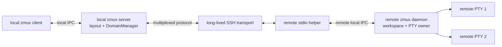
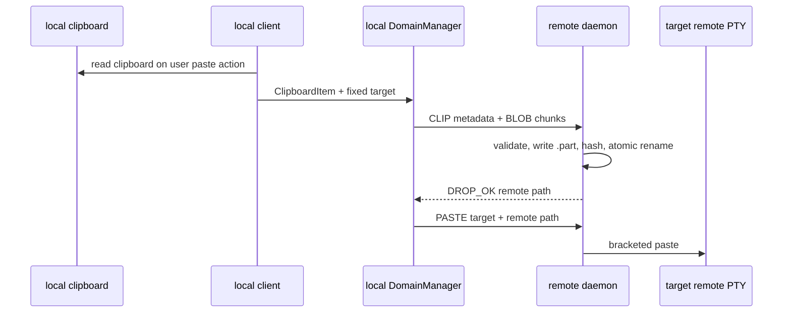

# zmux Cloud：本地编排、远端执行的 SSH Domain

## 文档定位

本文重新定义 `zmux ssh <host>` 的产品语义和实现架构。

目标不是在 pane 中嵌套远端 zmux，也不是把远端现有 zmux window 整体 graft 到本地。目标是：

> 本地 zmux 持有唯一的 layout、Prefix 和焦点；远端 zmux daemon 作为无界面的执行代理，提供可持久化 PTY、断线恢复和剪贴板文件投递。

这同时满足四个需求：

1. 进入远程状态后，split 自动在同一远端创建新 pane。
2. 本地与多个远端 pane 可以在一棵 layout 中混排。
3. 网络断开后远端 PTY 和前台进程继续存活并可恢复。
4. 本地复制的文本、图片和文件可以通过一次 zmux 粘贴动作投递到远程 pane。

## 已确定的边界

### 本地 zmux 是唯一控制平面

以下状态只由本地 zmux 管理：

- session、window 和 layout 树
- pane 几何、边框、zoom 和焦点
- Prefix 与快捷键
- `h/j/k/l` 视觉移动
- split、kill-pane 和 new-window
- 本地与远端 pane 的混排关系

远端 daemon 不决定本地 layout，也不向本地暴露一整棵远端 window 树。

### 远端 zmux 是执行代理

远端 daemon 负责：

- 创建、resize、输入和关闭远程 PTY
- 持有远程 shell 及其子进程
- 在 SSH 传输断开后继续保存 PTY
- 保存有限的终端快照/增量，供重连恢复
- 接收文本、图片和文件
- 将文件安全落盘并把远端路径注入目标 PTY
- 回收退出的子进程和空 workspace

完整能力需要远端安装协议兼容的 zmux，但不需要启动可见的 zmux client。若确认远端没有 zmux，`zmux ssh` 自动降级为 Direct SSH backend；用户仍能获得远程 shell和 Domain 继承，但不具备远端持久化与 ClipboardBus 文件投递。

### 两种 backend

```text
SshDomainBackend =
  Agent {
    workspace_id,
    remote_zmux_version,
    capabilities
  }
  Direct {
    ssh_process,
    degraded_capabilities
  }
```

| 能力 | Agent backend | Direct backend |
|---|---|---|
| 远程 shell | 是 | 是 |
| split/new-window 继承 host | 是 | 是，每个 pane 启动独立 SSH PTY |
| 断网恢复原 PTY | 是 | 否，只能创建新 shell |
| 本地 client detach | 远端 daemon 持续保存 | 本地 server 持有 SSH 进程时可持续 |
| 文本粘贴 | 是 | 是，直接写 PTY |
| 图片/文件自动上传 | 是 | 否，明确提示需要远端 agent |
| 远端进程统一 reaper | 远端 zmux daemon | 系统 sshd/本地 SSH 子进程生命周期 |

降级不能静默伪装为完整能力。状态栏必须区分：

```text
[ssh:linux]          # Agent backend
[ssh:linux/direct]   # Direct backend
```

### 不 attach 远端已有的普通 zmux session

`zmux ssh host` 创建或恢复专用的 **Domain Workspace**。它与远端桌面或终端中已有的普通 zmux session 分属不同 namespace：

```text
remote zmux daemon
├─ interactive sessions
│  ├─ default
│  └─ work
└─ domain workspaces
   ├─ ws-01...  ← local Mac / project A
   └─ ws-02...  ← another client
```

因此：

- 远端已有普通 zmux 实例不会被接管、resize 或切换焦点。
- `zmux ssh host` 不默认展示远端现有 window。
- 如果未来需要 attach 远端已有 session，必须使用另一条显式命令和独立语义。

## 用户体验

### 在本地 pane 中进入远程状态

```bash
zmux ssh linux
```

流程：

1. CLI 通过 `ZMUX_SOCKET`、`ZMUX_PANE` 找到当前本地 pane。
2. 本地 server 的 DomainManager 连接或恢复 `linux` workspace。
3. 远端 daemon 创建一个 PTY，并启动远程用户 shell。
4. 当前本地 leaf 绑定该远程 PTY。
5. 本地 shell 保留在绑定下面，等待 `zmux ssh` 返回。
6. 状态栏显示 `[ssh:linux]`。

当前 pane 不会被替换成远端 layout，它仍是本地 layout 中的一个 leaf，只是内容和输入暂时来自远端 PTY。

### 在普通终端中执行

```bash
zmux ssh linux
```

等价于：

1. 启动或连接本地 zmux daemon。
2. 创建一个带本地 fallback shell 的 pane。
3. 为该 pane 建立 `ssh:linux` RemoteBinding。
4. 打开本地 zmux client。

所有场景都只有一套本地 Prefix。

### split 与 new-window

创建操作默认继承焦点 pane 的 Domain：

| 操作 | 焦点为 `local` | 焦点为 `ssh:linux` |
|---|---|---|
| `Prefix + "` | 新建本地 pane | 本地 layout 新建 leaf，远端 workspace 新建 PTY |
| `Prefix + %` | 新建本地 pane | 同上 |
| `Prefix + c` | 新建本地 window | 新 window 的首 pane 绑定同一远端 workspace 的新 PTY |
| `Prefix + x` | 关闭本地 pane | 关闭远端 PTY，并关闭整个本地 pane |

同一 window 可以混排：

```text
window 0
├─ pane %1  local
├─ pane %2  ssh:linux / pty-r17
└─ pane %3  ssh:build.linux / pty-r03
```

split 始终先修改本地 layout，再通过 DomainManager 请求远端创建 PTY。远端创建失败时，新 leaf 应显示错误并回退到本地 shell，不能留下不可操作的空槽位。

### 退出远程状态

在远程 shell 中执行 `exit` 或 `Ctrl-D`：

1. 远端 shell 正常退出。
2. 远端 daemon 回收 child，发送 `PTY_EXITED`。
3. 本地 server 移除 RemoteBinding。
4. 当前 leaf 恢复下面的本地 shell。
5. 后续 split 继承 `local`。

如果一个 window 中所有 pane 都是远程的，它们也各自保留本地 fallback。最后一个远程 PTY 退出后，整个 window 自然回到本地，不需要专用“创建本地 pane”快捷键。

`Prefix + x` 与 shell `exit` 的语义不同：

- `exit`：离开远程状态，保留本地 pane。
- `Prefix + x`：关闭远程 PTY和整个本地 pane。

## 核心数据模型

### Domain

```text
DomainId {
  transport: "ssh",
  host_alias,
  workspace_id,
  workspace_generation
}
```

### 远程 PTY 引用

```text
RemotePtyRef {
  domain_id,
  pty_id,
  pty_generation
}
```

`pty_id` 不能只使用 OS PID。PID 会复用，所有请求和事件必须同时校验：

- workspace id
- workspace generation
- pty id
- pty generation

### 本地 leaf

```text
LocalPane {
  pane_id,
  fallback_pty,
  remote_binding: Option<RemoteBinding>
}

RemoteBinding {
  remote_pty: RemotePtyRef,
  state,
  last_frame,
  last_sequence,
  connection_generation
}
```

`fallback_pty` 始终由本地 server 所有。RemoteBinding 存在时：

- 普通输入送到远端 PTY。
- Prefix 仍由本地 client 处理。
- 本地 fallback shell 保持等待状态。
- 本地 renderer 不得用 fallback shell 的 ANSI 覆盖该 leaf。

RemoteBinding 移除后，leaf 立即恢复正常本地 pane。

### Domain Workspace

```text
DomainWorkspace {
  workspace_id,
  owner,
  generation,
  ptys: Map<PtyId, ManagedPty>,
  connection_state,
  created_at,
  disconnected_at,
  transfer_registry
}
```

一个 host 可以有多个 workspace。首版由本地 zmux 为每个 host/profile 维护一个 workspace，并将 workspace id/token 持久化到本地 server 元数据。

## 所有权与组件



关键所有权：

- 本地 client 只负责终端 UI 和系统剪贴板读取。
- 本地 server 持有 layout、RemoteBinding 和 SSH transport。
- SSH helper 只桥接协议，不能成为远程 PTY 的父进程。
- 远端长期 daemon 是所有远程 PTY 的父进程和唯一 reaper。

SSH transport 必须归本地 server/DomainManager，而不是某个短命 client。这样本地 client detach 后，连接和远程 pane 仍可继续。

## 连接与握手

### 首次连接

1. 读取 `~/.config/zmux/ssh.toml`。
2. 通过系统 OpenSSH 尝试启动远端 helper。
3. 根据明确结果选择 backend：
   - helper 成功：连接远端 daemon，没有 daemon 时原子启动，进入 Agent backend；
   - shell 明确返回 command-not-found/exit 127：进入 Direct backend；
   - 网络、认证、host key、权限或协议错误：返回真实错误，不冒充“远端没有 zmux”。
4. Agent backend 交换 protocol range、capability、limits。
5. Agent backend 创建或恢复 Domain Workspace，并创建远程 PTY。
6. Direct backend 在当前本地 pane PTY中启动普通交互 `ssh -t`。
7. 收到 Agent 首帧或确认 Direct PTY已启动后提交 RemoteBinding。

提交前必须两阶段处理：

- 连接失败时原本地 shell和 pane 不受影响。
- 首帧成功后才将输入路由切到远端。

远端 binary 存在但版本或 capability 不兼容时，默认应显示兼容性错误。配置 `mode = "auto"` 可以允许用户确认后降级 Direct，但不能把协议损坏、认证失败或任意 stderr 都当作“未安装”。

### Direct backend

Direct backend 保留最重要的交互：

1. 当前 pane 启动一个普通 SSH PTY。
2. split/new-window 仍继承 host。
3. 每个新远程 pane 创建独立 SSH 进程；OpenSSH 可按用户配置复用 ControlMaster。
4. remote `exit` 后恢复该 pane 的本地 fallback shell。
5. `Prefix + x` 终止 SSH 前台进程组并关闭 pane。

它不创建 Domain Workspace，不使用 RemotePtyRef，而是使用本地 `DirectPtyRef { pane_id, generation }`。Direct pane 仍属于本地 layout，输入和 resize 通过其本地 PTY自然进入 SSH。

### 重连

重连请求携带：

```text
workspace_id
workspace_generation
resume_token
last_seen_sequence per pty
```

远端校验 workspace 后：

- workspace 和 PTY仍存在：发送缺失增量或完整快照。
- workspace 存在但某 PTY 已退出：发送 `PTY_EXITED` 与 exit status。
- workspace 不存在：本地显示明确状态，用户选择创建新 workspace 或回本地。
- generation 不匹配：拒绝旧连接，避免迟到连接污染新状态。

## 断网语义

必须区分主动退出和 transport 断开。

### 主动退出

远端 PTY的 shell 退出时，执行正常回退：

```text
Remote → PTY_EXITED → Local
```

### 网络断开

SSH EOF、keepalive 超时或网络错误时：

```text
Attached → Disconnected → Reconnecting → Attached
```

此时：

- 远端 daemon 不关闭 PTY。
- 本地 RemoteBinding 不删除。
- leaf 显示最后一帧和 `disconnected/reconnecting` 状态。
- 输入暂存必须有严格小上限；默认可直接拒绝并提示，不能无限缓存。
- 重连后恢复同一个 `RemotePtyRef`。

可以提供：

```text
[r] retry now
[l] abandon remote and return local
[x] close pane and remote PTY
```

自动重连使用有上限的指数退避；用户手动 retry 立即触发。

### 为什么远端进程能存活

远程 PTY由长期运行的远端 daemon 持有，而不是 SSH channel/helper 持有。SSH helper 退出只会让 workspace 标记为 disconnected，不会关闭 PTY master，也不会向远端进程组发送 SIGHUP。

### Direct backend 断网

Direct backend 无远端 owner 保存 PTY。网络断开后：

1. SSH 进程退出，远端交互 shell通常也随 channel 结束。
2. pane 显示断线原因。
3. 用户可以选择重新连接到一个**新的**远程 shell，或回到本地 fallback shell。
4. UI不得声称能够恢复原进程或终端画面。

因此 Direct 是可用性 fallback，不是持久化 fallback。

## 远程 PTY 生命周期与清理

这里必须区分：

- **僵尸进程**：进程已退出，但父进程没有 `waitpid`。
- **受管但暂时无人连接的进程**：进程仍在运行，等待 workspace 重连。

后者是持久化功能，不是僵尸。

### 创建

远端 daemon 创建 PTY时：

1. 分配不可复用的逻辑 `pty_id` 和 generation。
2. 使用 `forkpty`/平台等价能力创建 shell。
3. child 成为独立 session/process group。
4. daemon 保存 PID、PGID、PTY master、generation 和状态。
5. 短命 stdio helper 不参与 fork，也不持有 child ownership。

```text
ManagedPty {
  pty_id,
  generation,
  pid,
  process_group,
  master,
  state,
  exit_status
}
```

### 唯一 child reaper

远端 daemon 必须有唯一的 child reaper：

1. 监听 `SIGCHLD` 或使用专用 wait 线程。
2. 循环执行 `waitpid(-1, WNOHANG)`，直到没有可回收 child。
3. 根据 PID + generation 找到 ManagedPty。
4. 读取剩余 PTY输出并关闭 master。
5. 标记 `Exited`，记录 exit code/signal。
6. 广播 `PTY_EXITED`。
7. 保留短期 tombstone 后删除记录。

禁止多个线程同时 wait 同一个 child。所有自然退出路径最终都必须经过 reaper。

### 主动关闭

`Prefix + x`、workspace kill 或明确关闭请求使用幂等 `CLOSE_PTY`：

```text
SIGHUP(process group)
  → grace period
SIGTERM(process group)
  → grace period
SIGKILL(process group)
  → waitpid
  → close master
  → CLOSE_OK
```

要求：

- 信号发送给整个受管进程组，不只发送给 shell PID。
- `CLOSE_OK` 只能在完成 wait/reap 后返回。
- 重复 `CLOSE_PTY` 返回同一最终结果。
- 请求必须校验 workspace/pty generation，防止 PID 复用误杀。

已主动 daemonize 并脱离受管 session/process group 的程序不属于 pane 生命周期；文档和 UI不能声称能够回收任意自行脱离的后台服务。

### 断网时不清理活跃 PTY

transport 断开只更新：

```text
workspace.connection_state = Disconnected
workspace.disconnected_at = now
```

不发送信号，不关闭 PTY master，不调用 kill。

### workspace GC

默认策略：

- 所有 PTY均已退出：自动删除空 workspace。
- 只有 exited tombstone：按短 TTL 清理。
- 仍有活跃 PTY：默认保留，不能静默杀死长任务。
- 用户明确 `workspace kill`：按进程组终止并回收全部 PTY。

必须提供：

```text
zmux remote ls
zmux remote inspect <workspace>
zmux remote kill <workspace>
zmux remote clean
```

并限制：

- 每个用户 workspace 数量
- 每个 workspace PTY数量
- scrollback/frame 历史内存
- 剪贴板传输并发和磁盘配额
- tombstone 和断线元数据 TTL

可选 `abandoned_workspace_ttl` 只能是显式配置。默认不应按时间误杀仍在运行的任务。

### daemon 退出或崩溃

首版优先保证“不留下不可管理孤儿”：

- 正常 shutdown：依次关闭所有 workspace PTY并 wait。
- Linux child 设置 `PR_SET_PDEATHSIG=SIGHUP` 等 parent-death 策略。
- 每个 PTY使用独立 process group，daemon 可完整清理。
- daemon crash 后 PTY不承诺恢复；应终止而不是成为永久孤儿。

如果未来要求“远端 daemon 自身重启后 PTY仍恢复”，需要再引入长期 workspace supervisor，并将 PTY ownership 移交给 supervisor。不能仅靠让 child 脱离 daemon 来伪造恢复能力。

## 剪贴板总线

### 用户目标

焦点位于远程 pane 时：

1. 本地复制文字、图片或文件。
2. 执行一次 zmux paste。
3. 内容自动传到 pane 所属远端。
4. 远端应用收到文本或远端文件路径。

用户不需要手动运行 `scp`、`pbcopy`、`xclip` 或输入临时路径。

该完整目标只适用于 Agent backend。Direct backend 的能力为：

- 文本：直接写入 SSH PTY，正常支持。
- 图片/文件：不静默丢弃，也不把本地路径粘贴到远端；显示“remote zmux agent is required for image/file paste”。

未来可以为 Direct backend 单独增加 SFTP/SCP uploader，但它必须复用同一安全目标冻结和文件校验模型，不能作为首版隐式行为。

### 数据流



### 类型

| 类型 | 远端行为 |
|---|---|
| 文本 | 直接语义化 `PASTE` 到目标 PTY |
| 图片 | 本地编码 PNG，上传后粘贴远端 PNG 路径 |
| 文件 | 上传普通文件，完成后粘贴远端路径 |

这里的“无缝粘贴图片”是一次用户动作完成“编码、上传、落盘、路径注入”。终端 PTY本身没有通用的“图片对象粘贴”协议；目标 CLI/TUI需要能够接受文件路径。如果未来某应用支持专用图片协议，可以增加 adapter。

### 粘贴目标必须冻结

开始粘贴时记录：

```text
PasteTarget {
  local_pane_id,
  RemotePtyRef,
  connection_generation
}
```

上传完成后不能重新读取当前焦点。只有原目标仍存在且 generation 匹配时才注入路径；否则文件保留并报告 `uploaded_not_injected`。

### 系统 Cmd+V 的限制

很多终端模拟器会自行消费 Cmd+V：

- 文本通常变成 `Event::Paste(text)`。
- 图片和文件可能完全不产生 TUI事件。

因此可靠入口必须是 zmux 可见的 paste action，例如 `Prefix + ]` 或用户在终端中映射的快捷键。不能承诺在所有终端中透明截获系统 Cmd+V 的图片内容。

### 文件安全

- drop 目录权限 `0700`，文件 `0600`
- server 生成 transfer id 和最终文件名
- basename 仅用于显示，剥离路径、NUL 和控制字符
- `.part` 使用 create-new/no-follow
- 校验声明大小、实际大小和 SHA-256
- 成功后原子 rename
- 失败、取消和 hash mismatch 删除 `.part`
- 拒绝 symlink、FIFO、device、socket；目录首版不支持
- 单文件、总批次、并发数、内存和磁盘都有硬上限
- transfer id + confirmed offset 支持安全续传
- drop 文件有 manifest、TTL、keep/delete/clean 命令

## 协议

SSH stdio 只承载一条多路复用二进制协议。至少包含：

| 消息 | 作用 |
|---|---|
| `HELLO` / `INCOMPATIBLE` | protocol、capability、limits |
| `WORKSPACE_OPEN` / `WORKSPACE_RESUME` | 创建或恢复 Domain Workspace |
| `PTY_CREATE` / `PTY_CREATED` | 创建远程 PTY |
| `PTY_FRAME` | 单个 PTY的结构化 frame/full snapshot |
| `PTY_INPUT` / `PTY_PASTE` | 定向输入 |
| `PTY_RESIZE` | 定向 resize |
| `PTY_CLOSE` / `PTY_CLOSED` | 幂等关闭及回收确认 |
| `PTY_EXITED` | 自然退出及 exit status |
| `CLIP` / `BLOB` / `WINDOW_UPDATE` | 剪贴板流控 |
| `DROP_OK` | 远端落盘完成 |
| `PING` / `PONG` | transport 健康与 RTT |

每条定向消息都携带完整 RemotePtyRef。禁止依赖远端 daemon 的“当前 active pane”。

### Frame

远端只发送单个 PTY的终端内容，不发送远端 layout：

```text
PtyFrame {
  RemotePtyRef,
  sequence,
  base_sequence,
  full,
  rows,
  cols,
  cells/runs,
  cursor,
  title,
  cwd,
  terminal_modes
}
```

本地 renderer 将 frame 裁剪到对应 local leaf。sequence 缺口或 reconnect 时请求 full snapshot。

### 流控

优先级：

1. input、resize、close ACK
2. PTY frame
3. clipboard BLOB

BLOB 必须有窗口、取消和内存硬上限，不能让大图片/文件阻塞按键回显。

## 配置

```toml
[hosts.linux]
ssh = "linux"
remote_zmux = "~/.cargo/bin/zmux"
workspace = "default"
drop_dir = "~/.zmux/drop"
mode = "auto"

[hosts.build]
ssh = "builder@10.0.0.8"
remote_zmux = "/usr/local/bin/zmux"
workspace = "project-a"
mode = "agent"

[hosts.legacy]
ssh = "old-server"
mode = "direct"
```

字段：

| 字段 | 含义 |
|---|---|
| `ssh` | OpenSSH target |
| `remote_zmux` | 远端 helper/daemon binary |
| `workspace` | 本地保存的逻辑 workspace profile |
| `drop_dir` | 远端安全投递目录 |
| `ssh_args` | 可选 argv 数组，不接受 shell 字符串 |
| `reconnect` | 自动重连策略 |
| `mode` | `auto`、`agent` 或 `direct` |

模式：

- `auto`：默认；仅在明确未找到 remote zmux 时自动降级。
- `agent`：要求完整能力；没有或不兼容时直接报错。
- `direct`：跳过 agent probe，直接启动普通 SSH PTY。

所有远端命令参数都必须 POSIX-safe quote，拒绝 NUL/换行。不能裸 `format!` 拼接。

## 实现切片

### 切片 0：冻结语义与清理边界

- [ ] 将 Agent backend 定义为创建/恢复 Domain Workspace
- [ ] 定义 Agent/Direct backend 与 capability matrix
- [ ] 只允许明确 command-not-found 触发自动降级
- [ ] 普通 remote session 与 domain workspace 分 namespace
- [ ] 定义 RemotePtyRef、generation 和幂等错误模型
- [ ] 定义自然 exit、Prefix+x、断网、daemon shutdown 的不同语义
- [ ] 单元测试覆盖 PID/pty id 复用与迟到事件

### 切片 1：远端 PTY Agent

- [ ] 远端 daemon 增加 workspace registry
- [ ] `PTY_CREATE/INPUT/RESIZE/CLOSE`
- [ ] 每个 PTY独立 session/process group
- [ ] 唯一 SIGCHLD reaper + waitpid drain
- [ ] close escalation + 最终 wait
- [ ] 空 workspace GC、inspect/kill/clean
- [ ] helper 只桥接，不 fork PTY

### 切片 2：本地 RemoteBinding

- [ ] local leaf 增加 fallback PTY + optional RemoteBinding
- [ ] 本地 server 持有 DomainManager 和 SSH transport
- [ ] split/new-window 继承 Domain 并创建远端 PTY
- [ ] remote exit 恢复 fallback shell
- [ ] 本地 renderer 合成单 PTY frame，不 graft 远端 layout
- [ ] 同窗 local + 多 host 混排
- [ ] Direct backend：每个继承 pane 启动独立 SSH PTY
- [ ] Direct exit 回本地；断网只允许新建 shell，不伪装 resume

### 切片 3：断线恢复

- [ ] workspace resume token 与 generation
- [ ] per-PTY frame sequence/full snapshot
- [ ] keepalive、断线状态和指数退避
- [ ] 手动 retry/local/close
- [ ] 本地 client detach 不影响 DomainManager
- [ ] 断线期间 input 默认拒绝或有界缓存

### 切片 4：ClipboardBus

- [ ] 本地 clipboard backend：文本、PNG、平台文件列表
- [ ] 固定 PasteTarget
- [ ] `CLIP/BLOB/WINDOW_UPDATE/CANCEL/DROP_OK`
- [ ] 安全 drop、hash、quota、TTL、取消和续传
- [ ] 上传完成后向原 RemotePtyRef 注入路径
- [ ] BLOB 压测不饿死 input/frame

### 切片 5：迁移旧 Cloud 实现

- [ ] 保留可复用的 v2 envelope、capability、blob 和 SSH transport
- [ ] 将连接 ownership 从 client 移到本地 server DomainManager
- [ ] 移除“远端整窗 graft 到 ExternalSlot”的默认路径
- [ ] 移除远端全局 active pane 依赖
- [ ] 将 cloud lease 改为 workspace/PTY级并发控制
- [ ] 旧的远端 session attach 若保留，改成独立显式命令

## 测试矩阵

| 类别 | 必测场景 |
|---|---|
| 用户路径 | pane 内/外 `zmux ssh`、split 继承、new-window、混排多 host |
| backend 选择 | agent 成功、明确未安装→direct、强制 agent/direct、错误不得误降级 |
| 退出 | remote `exit` 回本地；Prefix+x 关闭整个 pane |
| 断网 | helper kill、SSH EOF、长断网、重连同一 PTY、迟到旧连接 |
| Direct 断网 | 原 PTY不可恢复、重连创建新 shell、回本地 fallback |
| PTY回收 | 正常 exit、signal exit、close escalation、waitpid、PID 复用 |
| workspace | 空 workspace GC、活跃 workspace 保留、显式 kill、配额 |
| daemon crash | parent-death、无不可管理孤儿、重启后明确状态 |
| frame | sequence 缺口、full resync、resize、Unicode、alternate screen |
| clipboard | 文本、PNG、文件、怪异文件名、hash 错、超限、取消、续传 |
| Direct clipboard | 文本可用；图片/文件返回明确 capability 错误 |
| 粘贴竞争 | 上传时切焦点、目标退出、目标 generation 改变 |
| 性能 | 大 BLOB 同时持续输入和 frame，输入延迟有明确预算 |
| 兼容性 | protocol major、minor overlap、缺 capability、旧 daemon |

日志必须包含：

- host/domain/workspace id
- pty id + generation
- connection generation
- request/transfer id
- child PID/PGID 和退出原因

日志不得包含：

- 剪贴板正文
- 文件内容
- SSH secret/token
- 用户输入流

## 验收标准

1. 本地 pane 执行 `zmux ssh linux` 后进入远程 shell。
2. `Prefix + "` / `%` 创建同 host 的新远程 PTY，但 layout 仍由本地管理。
3. 远端已有普通 zmux session 不被 attach、resize 或改变焦点。
4. 远程 shell执行 `exit` 后该 pane 恢复原本地 shell。
5. Agent backend 网络断开后远程进程继续运行；重连恢复同一个 PTY及其画面。
6. Agent backend 的 `Prefix + x` 最终杀死并 wait 整个受管进程组，不留下 zombie。
7. Agent backend 的所有 PTY自然退出都会被唯一 reaper 回收。
8. Agent backend 中，本地复制 PNG 并执行一次 zmux paste 后，远端安全目录出现 PNG，原目标 PTY收到其路径。
9. Agent backend 上传期间切换焦点不会把路径注入错误 pane。
10. 本地 client detach/reattach 不会断开 Agent SSH Domain。
11. Agent backend 的空 workspace 自动清理，活跃 workspace 不因普通断网被误杀。
12. Agent backend 大文件传输期间远程按键和 frame 仍可用。
13. 远端明确没有 zmux 时自动进入 Direct backend，远程 shell、split 继承和本地回退仍正常。
14. Direct backend 断网后不宣称恢复原 PTY；图片/文件粘贴给出明确的 agent 能力提示。
15. 认证、网络和 host key 错误不会被错误分类为“远端没有 zmux”。

## 最终决策

- 本地 zmux 是 layout、Prefix 和焦点的唯一权威。
- 远端 zmux 是 PTY、持久化和文件投递代理。
- `zmux ssh` 使用专用 Domain Workspace，不 attach 普通远端 session。
- 每个本地 remote leaf 映射一个 RemotePtyRef，不 graft 远端 layout。
- split/new-window 继承焦点 Domain。
- remote `exit` 回到本地 fallback shell；Prefix+x 关闭整个 pane。
- 断网保留远端 PTY并重连恢复。
- helper 不拥有 PTY；远端长期 daemon 是唯一 parent/reaper。
- 自然退出必须 waitpid，主动关闭必须 kill process group 后 wait。
- Agent backend 的图片/文件通过 ClipboardBus 上传并向固定目标注入远端路径。
- 活跃 workspace 默认不按时间静默清理；空 workspace 和 tombstone 自动 GC。
- `mode=auto` 仅在明确检测到远端没有 zmux 时降级为 Direct backend。
- Direct backend 仍继承 host 并创建独立 SSH PTY，但不提供持久化、原 PTY恢复和图片/文件投递。
